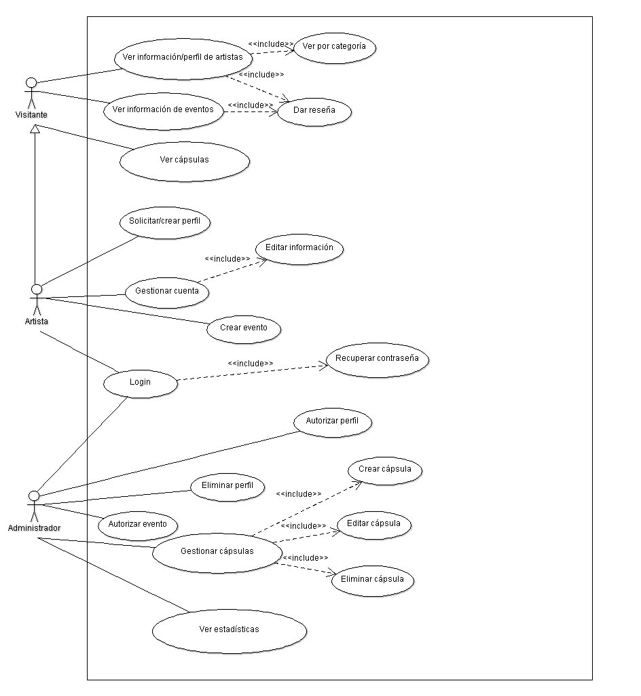
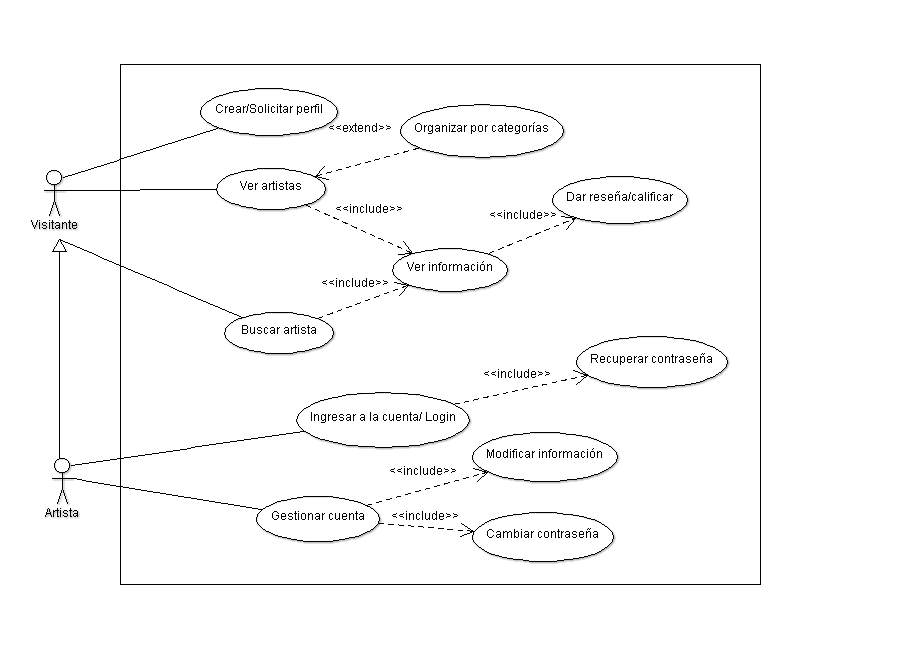
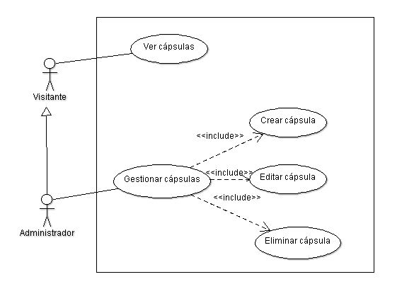

Diseño de la aplicacíon
=======================

Casos de Uso
------------

Diagrama general
^^^^^^^^^^^^^^^^

.. _artistas-label:

Módulo: artistas
^^^^^^^^^^^^^^^^^^

.. _eventos-label:

Módulo: eventos
^^^^^^^^^^^^^^^^^
.. image:: CasosDeUso/moduloEventos.png

.. _capsulas-label:

Módulo: cápsulas informativas
^^^^^^^^^^^^^^^^^^^^^^^^^^^^^^^

.. _admin-label:

Módulo: Administrativo
^^^^^^^^^^^^^^^^^^^^^^
.. image:: CasosDeUso/moduloAdministrativo.png

Clases
------

Diagramas de clases y de sus distintas actividades, si fuese necesario.

Diagrama de BD
--------------

Diagrama de la Base de Datos que requerirá el software.
