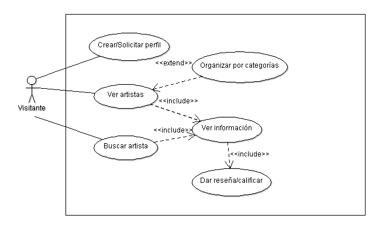
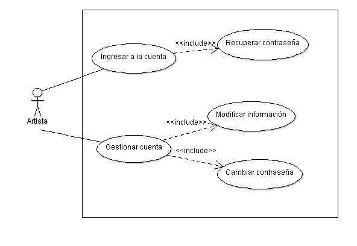
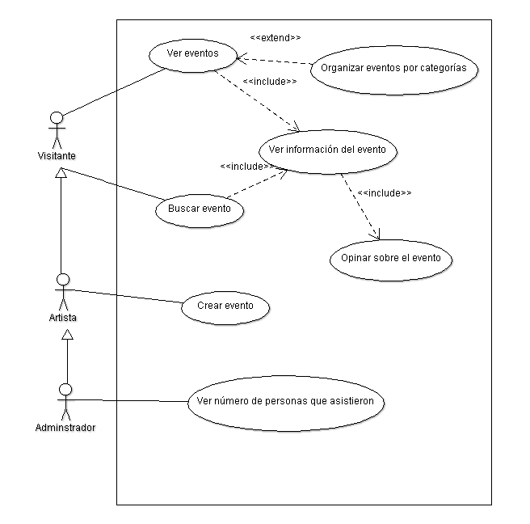
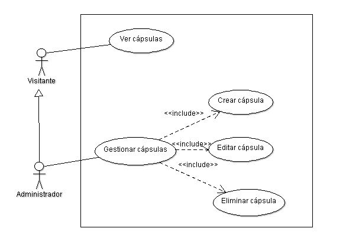
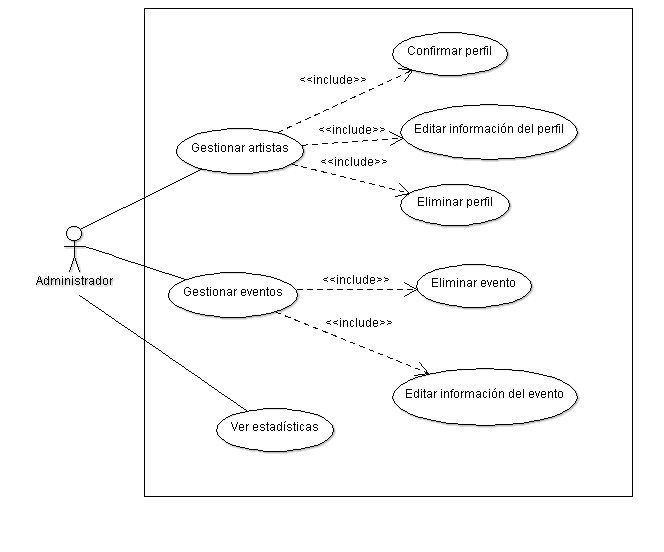
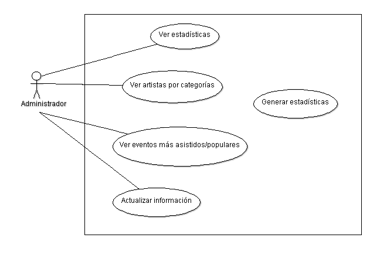
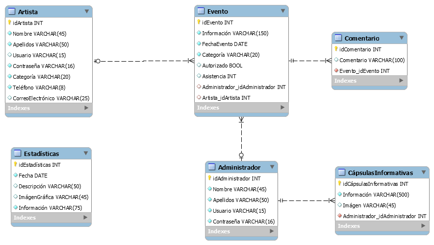

Diseño de la aplicacíon
=======================

Casos de Uso
------------

.. _artistas-label:

Módulo: artistas
^^^^^^^^^^^^^^^^^^

Submódulo: visitante

Submódulo: artista

.. _eventos-label:

Módulo: eventos
^^^^^^^^^^^^^^^^^

.. _capsulas-label:

Módulo: cápsulas informativas
^^^^^^^^^^^^^^^^^^^^^^^^^^^^^^^

.. _admin-label:

Módulo: Administrativo
^^^^^^^^^^^^^^^^^^^^^^

Submódulo: estadísticas

Diagrama de BD
--------------

