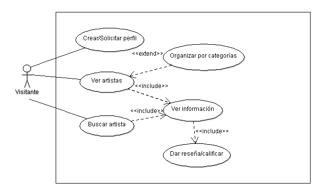
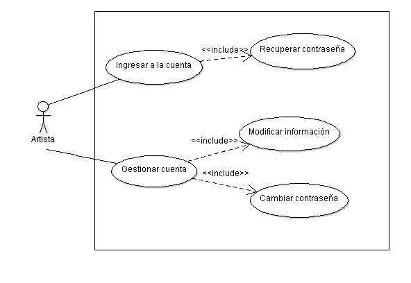
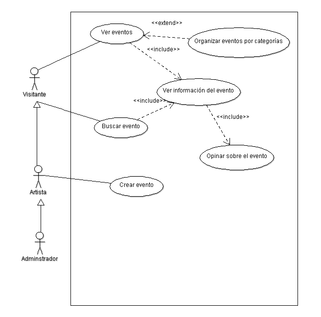
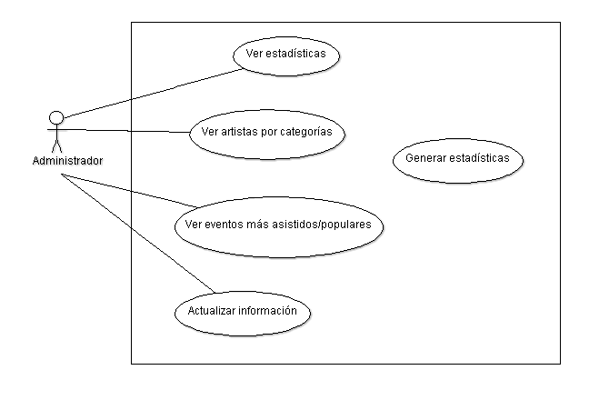

Diseño de la aplicacíon
=======================

Casos de Uso
------------

.. _artistas-label:

Módulo: artistas
^^^^^^^^^^^^^^^^^^

Submódulo: visitante

Submódulo: artista

.. _eventos-label:

Módulo: eventos
^^^^^^^^^^^^^^^^^

.. _capsulas-label:

Módulo: cápsulas informativas
^^^^^^^^^^^^^^^^^^^^^^^^^^^^^^^

.. image:: CasosDeUso/moduloCapsulas.png
  :scale: 100%
  :align: center

.. _admin-label:

Módulo: Administrativo
^^^^^^^^^^^^^^^^^^^^^^

.. image:: CasosDeUso/moduloAdministrativo.png
  :scale: 80%
  :align: center

Submódulo: estadísticas

Clases
------

Diagramas de clases y de sus distintas actividades, si fuese necesario.

Diagrama de BD
--------------

Diagrama de la Base de Datos que requerirá el software.
