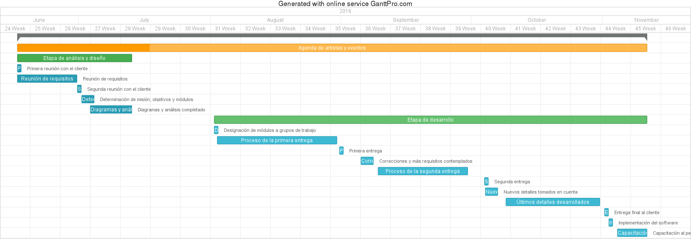

Desarrollo del proyecto
=======================

Cómo se trabajará
-----------------

Se trabajará mediante el modelo MDSD, el cual es un desarrollo creciente e
iterativo, y nos da la opción de replantear nuestros requisitos así como
revertir algunos, este requerirá más juntas con el cliente con cada entrega
que se realice, esto con el objetivo de:

  * Involucrar al cliente y que visualice el proceso actual del sistema.
  * El cliente sabe con anterioridad cómo será el sistema en su fase final.
  * Ideal para presupuestos y agendas que se acoplen a las necesidades de la
    empresa.
  * Los cambios durante el proyecto son  facilmente reversibles.
  * Durante el ciclo de vida del proyecto se realizan cambios para evitar futuros
    arreglos y mantenimientos una vez entregado el sistema.

Actividades a realizar
----------------------

  * Análisis
  * Desarrollo
  * Pruebas
  * Implementación
  * Capacitaciones
  * Mantenimiento

Entregables
-----------

  * Manuales:
      Donde se explican y detallan qué hace cada parte del software
  * Sistema:
      El sistema completamente funcional, acorde a los requisitos del cliente.

Tabla de tiempos y costos
-------------------------

